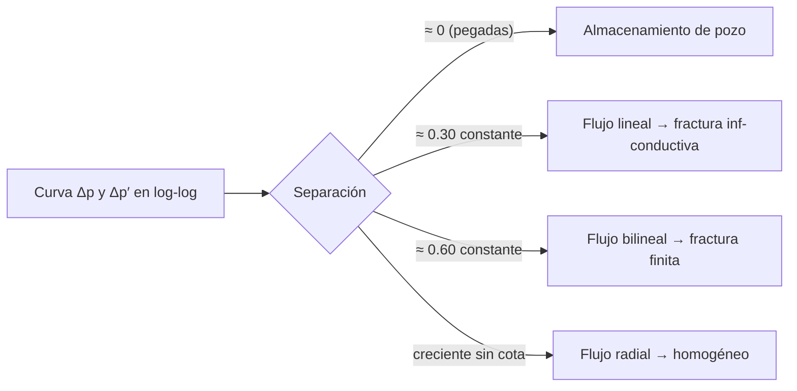

# Separación presión-derivada (Δp vs Δp′)

> **Dominio**: petróleo (análisis de pruebas de presión)
> **Prerrequisitos**: [[02_regimenes_flujo_pendiente_loglog]]
> **Dificultad**: intermedio

## Intuición

En el gráfico log-log de una prueba de presión se dibujan dos curvas: el cambio de
presión `Δp` y su derivada de Bourdet `Δp′ = t·d(Δp)/dt`. Un intérprete senior no
mira solo la *forma* de cada curva — mira **la distancia vertical entre ellas**. Esa
distancia (la "separación") es una firma del régimen de flujo: durante el
almacenamiento de pozo las dos curvas van **pegadas** sobre la recta unitaria;
durante el flujo lineal de una fractura van **paralelas separadas un factor 2**
(≈0.3 décadas); en flujo radial la separación **crece sin parar**. Es uno de los
discriminadores manuales más confiables entre un yacimiento homogéneo y uno con
fractura de conductividad infinita — justo el par que más confunde al modelo.

## Formalismo

La derivada de Bourdet es la derivada respecto del logaritmo del tiempo:

$$ \Delta p' = \frac{d\,\Delta p}{d \ln t} = t \cdot \frac{d\,\Delta p}{dt} $$

Si el régimen sigue una ley de potencia $\Delta p = A\,t^{n}$, entonces:

$$ \Delta p' = t \cdot A\,n\,t^{n-1} = n \cdot \Delta p $$

y la separación en log-log es una **constante exacta**:

$$ \log_{10}\Delta p - \log_{10}\Delta p' = -\log_{10} n $$

- **Almacenamiento** ($n=1$): separación $= \log_{10}(1) = 0$ — las curvas coinciden.
- **Flujo lineal de fractura** ($n=\tfrac12$, $\Delta p \propto \sqrt{t}$):
  separación $= \log_{10}(2) \approx 0.301$ — exactamente un factor 2.
- **Flujo bilineal** ($n=\tfrac14$): separación $= \log_{10}(4) \approx 0.602$.
- **Flujo radial** (no es ley de potencia): $\Delta p \propto \ln t$ crece mientras
  $\Delta p'$ se estabiliza en una meseta constante (0.5 adimensional), así que la
  separación crece como $\log_{10}(\ln t)$ — sin cota dentro de la ventana.

Cada símbolo: $t$ = tiempo de flujo, $A$ = constante del régimen, $n$ = exponente de
la ley de potencia que define el régimen.

## Flujo / mecanismo

## Contexto de dominio

La física es la razón de la firma: en una fractura de conductividad infinita el
fluido entra por toda la cara de la fractura y la presión difunde en 1D
(perpendicular a ella), lo que produce $\Delta p \propto \sqrt{t}$ [Gringarten1974].
En flujo radial la difusión es 2D alrededor del pozo y la solución es logarítmica
(función exponencial integral). La separación distingue ambos **aunque las formas
estandarizadas se parezcan**, porque codifica la relación *absoluta* entre las dos
curvas, no su forma individual.

## Cómo se aplica en este proyecto

El canal `"sep"` de la representación reconstruye exactamente esta cantidad sobre la
malla log de 256 puntos, con normalización por **constantes fijas** (no per-curva,
porque el nivel absoluto ES la señal) y clip raw a $[-1, 3]$ (cuando la derivada se
desploma en una frontera de presión constante, la separación explota a ±15 y
saturaría la escala de entrada).

Aplicado en: `src/deep_pta/data/representation.py` (`build_representation`,
`_SEP_MEAN/_SEP_STD/_SEP_RAW_MIN/_SEP_RAW_MAX`). Test analítico:
`tests/test_representation_channels.py::test_sep_reads_log10_2_on_linear_flow`.

## Por qué esto y no la alternativa

La representación v1/v2 estandarizaba `log10(Δp)` y `log10(Δp′)` **por separado y
per-curva** (media 0, varianza 1) para que el modelo aprendiera forma invariante a
escala — pero eso **destruye la separación**: tras estandarizar, la distancia entre
canales ya no es log10(2) ni nada físico. El prototipo v3 (2026-06-09) midió el
costo: devolver sep+slope dio **+0.025** de balanced accuracy de yacimiento con
300k curvas, más que el salto de 2M→5M curvas del ciclo v2 (+0.02). La alternativa
"no estandarizar nada" se descartó porque la invariancia de forma sí ayuda — la
solución es tener ambas: forma estandarizada (canales 0-1) + nivel físico (canal sep).

## Autoevaluación

1. ¿Por qué la separación vale exactamente log10(2) en flujo lineal y no otro número?
2. Si las curvas Δp y Δp′ van pegadas durante 2 décadas al inicio de la prueba,
   ¿qué régimen domina y qué parámetro lo controla?
3. ¿Por qué estandarizar cada canal per-curva destruye esta señal, y por qué el
   canal sep usa constantes de normalización fijas?

## Referencias

- Gringarten, A.C., Ramey, H.J. & Raghavan, R. (1974). *Unsteady-State Pressure
  Distributions Created by a Well With a Single Infinite-Conductivity Vertical
  Fracture.* SPEJ 14(4), 347–360. `[Gringarten1974]`
- Bourdet, D., Ayoub, J.A. & Pirard, Y.M. (1989). *Use of Pressure Derivative in
  Well-Test Interpretation.* SPEFE 4(2), 293–302. `[Bourdet1989]`
- Bourdet, D. (2002). *Well Test Analysis: The Use of Advanced Interpretation
  Models.* Elsevier. `[Bourdet2002]`
- Bibliografía completa con claves: `documentation/04_referencias.md`.
