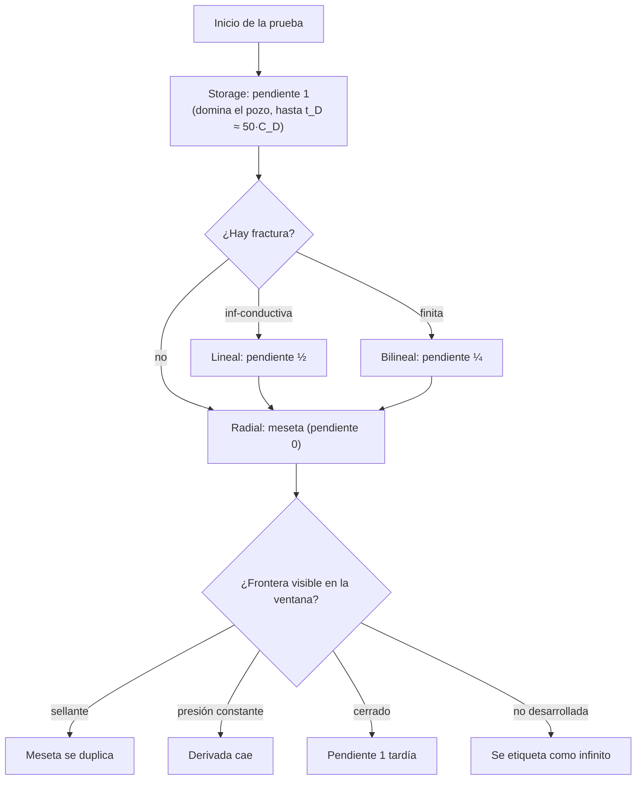

# Regímenes de flujo y pendiente log-log de la derivada

> **Dominio**: petróleo (análisis de pruebas de presión)
> **Prerrequisitos**: ninguno (nota base del dominio)
> **Dificultad**: básico

## Intuición

Una prueba de presión es una "ecografía" del yacimiento: se perturba el pozo (se
abre o cierra) y se registra cómo responde la presión en el tiempo. La respuesta
pasa por **etapas** — primero domina el pozo mismo, luego la vecindad inmediata
(¿hay fractura?), luego el yacimiento (flujo radial), y al final las fronteras.
Cada etapa deja una **pendiente característica** en el gráfico log-log de la
derivada de Bourdet. Leer esas pendientes en orden es el lenguaje del diagnóstico:
la derivada es al intérprete lo que el electrocardiograma al cardiólogo.

## Formalismo

Si un régimen sigue $\Delta p \propto t^{n}$, su derivada de Bourdet
$\Delta p' = t\,\frac{d\Delta p}{dt} = n\,A\,t^{n}$ tiene **la misma pendiente $n$**
en log-log:

$$ \frac{d \log_{10} \Delta p'}{d \log_{10} t} = n $$

| Régimen | Pendiente $n$ | Causa física | Referencia |
|---|---|---|---|
| Almacenamiento de pozo | $1$ | El pozo se llena/vacía como un tanque: $\Delta p \propto t$ | [Agarwal1970] |
| Flujo lineal (fractura inf-conductiva) | $\tfrac12$ | Difusión 1D perpendicular a la fractura | [Gringarten1974] |
| Flujo bilineal (fractura finita) | $\tfrac14$ | Difusión simultánea en la fractura y en la formación | [CincoLey1978] |
| Flujo radial | $0$ (meseta en 0.5) | Difusión 2D: $\Delta p \propto \ln t$, derivada constante | [Bourdet1983] |
| Frontera sellante | $0 \to$ duplicación de la meseta | El pozo imagen suma su caída de presión | [Horne1995] |
| Frontera de presión constante | caída de la derivada | El acuífero/casquete sostiene la presión | [Horne1995] |
| Cerrado (pseudo-estacionario) | $1$ tardía | El yacimiento entero se despresuriza como tanque | [Horne1995] |

El final del almacenamiento escala con el coeficiente adimensional $C_D$:
$t_D \approx 50\,C_D$ — con $C_D$ alto, el "hump" de storage **tapa** los regímenes
tempranos (la firma ½ de la fractura puede quedar enmascarada por completo). Este
*storage masking* es la causa física del techo de extrapolación del modelo.

## Flujo / mecanismo

## Contexto de dominio

Las pendientes no son convenciones: son soluciones de la ecuación de difusividad en
geometrías distintas. La dimensionalidad del flujo (1D lineal, 2D radial) fija el
exponente. Por eso son **invariantes a traslaciones en log-t**: cambiar $C_D$ o la
permeabilidad desplaza la curva horizontalmente, pero las pendiente s se conservan
— una pendiente ½ es flujo lineal esté donde esté en la ventana.

## Cómo se aplica en este proyecto

El canal `"slope"` calcula la pendiente local
$d\log_{10}\Delta p'/d\log_{10}t$ sobre la malla (derivar con `np.gradient` →
suavizar con media móvil de 9 puntos → clip a ±2), dándole al modelo el "lector de
regímenes" directamente como entrada. Por su invariancia a log-t es la palanca
estructural de **extrapolación** a storage alto: el prototipo v3 midió +0.038 de
balanced accuracy de yacimiento en el test de extrapolación.

Aplicado en: `src/deep_pta/data/representation.py` (`_slope_channel`). Tests:
`tests/test_representation_channels.py` (pendiente ½ exacta sobre $\Delta p'
\propto \sqrt{t}$, 1.0 en storage). Las pendientes son también la base de la
certificación del motor (`tests/test_engine_typecurves.py`) y del filtro de validez
del muestreo (`src/deep_pta/data/sampling.py`, que reetiqueta fronteras no
desarrolladas como "infinito").

## Por qué esto y no la alternativa

Alternativas consideradas en el diseño v3: histogramas de pendiente como features
escalares (subsumidos por el canal completo + pooling global del ResNet) y la
segunda derivada (descartada: amplifica el ruido del gauge sin añadir firma). La
pendiente local suavizada conserva la localización temporal del régimen — que es lo
que una cabeza de segmentación de regímenes (E17, pendiente) podrá supervisar.

## Autoevaluación

1. ¿Por qué el flujo lineal da pendiente ½ y el bilineal ¼? ¿Qué geometría de
   difusión hay detrás de cada uno?
2. Con $C_D = 10^4$, ¿hasta qué $t_D$ aproximado llega el hump de storage y qué
   regímenes puede tapar?
3. ¿Por qué la pendiente log-log es invariante a traslaciones en log-t y qué
   implica eso para la extrapolación del modelo a storage no visto?

## Referencias

- Bourdet, D., Whittle, T.M., Douglas, A.A. & Pirard, Y.M. (1983). *A New Set of
  Type Curves Simplifies Well Test Analysis.* World Oil 196(6), 95–106. `[Bourdet1983]`
- Gringarten, A.C., Ramey, H.J. & Raghavan, R. (1974). *Unsteady-State Pressure
  Distributions…* SPEJ 14(4), 347–360. `[Gringarten1974]`
- Cinco-Ley, H., Samaniego, F. & Domínguez, N. (1978). *Transient Pressure Behavior
  for a Well With a Finite-Conductivity Vertical Fracture.* SPEJ 18(4), 253–264. `[CincoLey1978]`
- Horne, R.N. (1995). *Modern Well Test Analysis* (2ª ed.). Petroway. `[Horne1995]`
- Agarwal, R.G., Al-Hussainy, R. & Ramey, H.J. (1970). *An Investigation of Wellbore
  Storage and Skin Effect…* SPEJ 10(3), 279–290. `[Agarwal1970]`
- Bibliografía completa con claves: `documentation/04_referencias.md`.
