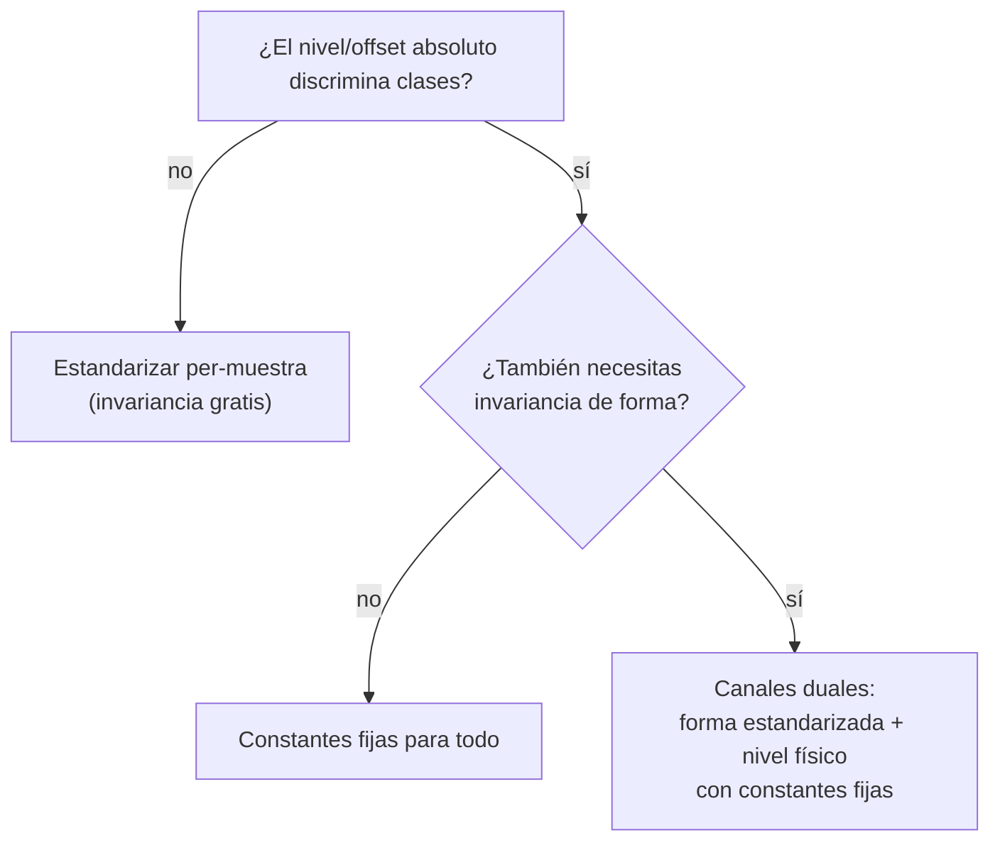

# Normalización per-muestra vs constantes fijas: cuándo destruye señal

> **Dominio**: ML (representación de entrada)
> **Prerrequisitos**: [[01_separacion_presion_derivada]], [[02_regimenes_flujo_pendiente_loglog]]
> **Dificultad**: intermedio

## Intuición

Estandarizar cada muestra (media 0, varianza 1) es el reflejo automático del ML:
hace al modelo invariante a la escala y estabiliza el entrenamiento. Pero la
invariancia es un arma de doble filo — **lo que la normalización vuelve invariante,
el modelo ya no puede verlo**. Si el nivel absoluto, el offset entre canales o la
amplitud SON la señal discriminante, estandarizar per-muestra equivale a borrarle
al modelo la columna que contenía la respuesta. La pregunta correcta antes de
normalizar nunca es "¿cómo escalo?" sino "¿qué información estoy dispuesto a
perder?".

## Formalismo

La estandarización per-muestra de un canal $c$ es

$$ \tilde c = \frac{c - \mu_c}{\sigma_c}, \qquad \mu_c = \tfrac1N\textstyle\sum_i c_i,\ \ \sigma_c = \sqrt{\tfrac1N\sum_i (c_i-\mu_c)^2} $$

donde $\mu_c, \sigma_c$ se calculan **de esa misma curva**. Es invariante a la
transformación afín $c \mapsto a\,c + b$ (con $a>0$): dos curvas que difieren solo
en nivel u amplitud se vuelven **indistinguibles**. Si dos canales $p$ y $d$ se
estandarizan por separado, cualquier función de su diferencia absoluta
$f(p - d)$ — como la separación $\log_{10}\Delta p - \log_{10}\Delta p'$, que vale
exactamente $\log_{10} 2$ en flujo lineal — deja de ser computable: el modelo
recibe $\tilde p$ y $\tilde d$ con offsets borrados independientemente.

La alternativa que preserva el nivel es la normalización por **constantes fijas del
dataset** (o del dominio):

$$ \tilde c = \frac{c - \mu_0}{\sigma_0} \quad (\mu_0, \sigma_0\ \text{fijas}) $$

que solo reescala — es biyectiva e igual para todas las muestras, así que ninguna
relación entre muestras ni entre canales se pierde.

## Flujo / mecanismo

## Contexto de dominio

En PTA el diagnóstico manual usa **ambas** cosas: la forma de la derivada (regímenes)
y los niveles absolutos (separación Δp−Δp′, posición temporal del hump de storage).
La representación v1 estandarizaba todo per-curva → el modelo veía forma pero no
niveles. Dos parches sucesivos lo confirmaron empíricamente: el canal de tiempo
absoluto (v1, normalizado con constantes fijas `_LOG_T_MEAN/_LOG_T_STD`) y los
canales sep+slope (v3).

## Cómo se aplica en este proyecto

`src/deep_pta/data/representation.py::build_representation`: canales 0-1 (presión,
derivada) estandarizados per-curva — dan invariancia de forma; canal 2 (log-tiempo)
y canal `sep` con **constantes fijas** — el nivel es la señal; canal `slope` sin
normalizar (ya es O(1) y físicamente acotado, solo clip ±2). El recorte del canal
`sep` a su banda informativa raw $[-1,3]$ es parte de la misma disciplina: una cola
de ±15 raw (derivada en el floor del log) reventaría la escala de entrada
(std 4.4, ±31σ medidos en el set de 300k antes del clip).

Evidencia del prototipo v3 (2026-06-09, 2 semillas): restaurar sep+slope dio
**+0.025** de balanced accuracy de yacimiento, **+0.103** de recall en homogéneo y
**−0.071** de MAE con 300k curvas — más que el +0.02 que costó escalar de 2M a 5M
curvas en v2. Restaurar señal destruida > escalar datos.

## Por qué esto y no la alternativa

- *¿Quitar la estandarización per-curva y usar solo constantes fijas?* No: la
  invariancia de forma sí ayuda (k·h desplaza las curvas órdenes de magnitud; sin
  estandarizar, el modelo gastaría capacidad en aprender esa invariancia).
- *¿Dejar que la red "aprenda" la separación de los canales crudos?* No puede: tras
  la estandarización independiente la información ya no está en la entrada. Ninguna
  arquitectura recupera información que la representación destruyó (data processing
  inequality, en versión práctica).
- *¿BatchNorm/LayerNorm en la red en vez de normalizar la entrada?* Resuelve la
  estabilidad numérica, no la pérdida de señal: la decisión de qué es invariante se
  toma en la representación, antes de la primera capa.

## Autoevaluación

1. ¿Por qué estandarizar dos canales por separado destruye cualquier función de su
   diferencia absoluta? ¿Qué transformación vuelve indistinguibles a las curvas?
2. En este proyecto, ¿qué canales usan constantes fijas y por qué cada uno?
3. Te dan un dataset de espectros donde la amplitud absoluta del pico discrimina la
   clase. ¿Cómo diseñas la normalización?

## Referencias

- Resultados del prototipo: `outputs/ablation/proto_v3_*.json` y
  `documentation/07_reporte_mejora_accuracy.md` (sección Ciclo v3).
- Concepto de separación: [[01_separacion_presion_derivada]].
> [referencia por confirmar: tratamiento formal de invariancias inducidas por
> normalización de entrada en deep learning — buscar revisión peer-reviewed]
