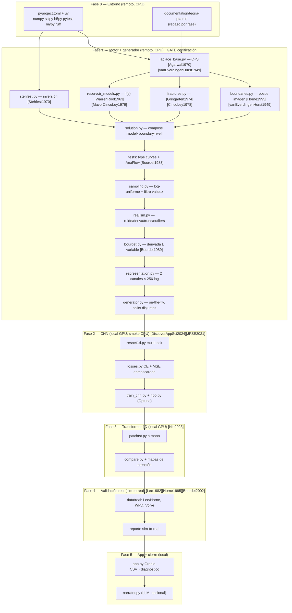

# Deep PTA — Plan de implementación detallado

> Plan ejecutable de las 5 fases con las fórmulas del motor, el layout de archivos, los
> gates de verificación y la **bibliografía por módulo**. Las claves `[clave]` remiten a
> `documentation/referencias.md`. Idioma: español (plan/bitácora); el código y sus
> identificadores van en inglés con docstrings NumPy style (`CLAUDE.md`).

## 1. Contexto y objetivo

Red neuronal que lee la curva Δp + **derivada de Bourdet** `[Bourdet1983]` `[Bourdet1989]`
en log-log y hace el trabajo del intérprete senior: (1) **clasifica** el modelo de
yacimiento (4 clases) y la frontera (4 clases) en **dos cabezas factorizadas**, y (2)
**estima** los parámetros clave (`k·h, S, C, ω, λ, L, x_f`). Se entrena con un dataset
**100% sintético** generado por un motor analítico (Laplace + inversión Stehfest
`[Stehfest1970]`) **certificado** contra type curves publicadas y `AnaFlow`/`welltestpy`
antes de entrenar nada. Cierra con una app Gradio (CSV → diagnóstico + curva ajustada) y
un agente narrador LLM opcional.

**No existe dataset público etiquetado de PTA** → el motor analítico ES el corazón del
proyecto: etiquetas perfectas por construcción.

### Dónde corre cada cosa

Este contenedor remoto es **CPU y efímero**. Reparto realista del cómputo:

| Trabajo | Dónde | Por qué |
|---|---|---|
| Motor analítico + generador + certificación (`pytest`) | **Remoto (CPU)** | NumPy/SciPy puro, sin GPU. |
| Entrenamiento CNN / Transformer + HPO Optuna | **Local (RTX 4080, WSL2/CUDA)** | Necesita GPU; el remoto sólo valida build + overfit de 1 batch en CPU. |
| Validación real (digitalización, transcripción) | **Remoto datos / Local inferencia** | Datos se preparan en remoto; inferencia con checkpoints, en local. |
| App Gradio + narrador | **Local** | Ejecución interactiva y modelo entrenado. |

El plan deja **todo el código listo y verificado en lo posible**; el cómputo pesado se
lanza en local tras `git pull`.

### Gate de verificación (obligatorio — `.claude/rules/verification.md`)

Ninguna tarea está completa hasta:

```text
test:        pytest -q
type-check:  mypy src/
lint:        ruff check .
format:      ruff format --check .
```

**Gate reforzado de Fase 1**: el motor debe estar **certificado** contra type curves
`[Bourdet1983]` `[Gringarten1974]` y `AnaFlow`/`welltestpy` **antes** de cualquier
entrenamiento. Es la regla dura del proyecto.

## 2. Arquitectura y orden de dependencias



**Regla dura**: nada de F2+ se entrena hasta que `CERT` pasa. `GEN` sólo se conecta a
los modelos con el motor ya certificado.

### Layout de paquete (emerge por fase, no se crea de golpe)

```
src/deep_pta/
  engine/    stehfest, laplace_base, reservoir_models, fractures, boundaries, solution
  data/      sampling, realism, bourdet, representation, generator
  models/    resnet1d, patchtst, losses
  train/     train_cnn, hpo, compare
  app/       app, narrator
tests/       test_stehfest, test_engine_typecurves, test_engine_vs_anaflow,
             test_sampling, test_bourdet, test_generator, test_train_smoke
data/        synthetic_test.h5 (gitignored), real/ (casos)
outputs/     figuras, matrices de confusión, mapas de atención (gitignored)
```

---

## 3. Fase 0 — Entorno y configuración (remoto, CPU)

1. **`pyproject.toml`** (PEP 621, build `hatchling`, gestión `uv`). Python `>=3.11`.
   - base: `numpy`, `scipy`, `h5py`.
   - dev: `pytest`, `mypy`, `ruff`, `matplotlib`.
   - extras opcionales (no requeridos en remoto): `[ml]` (`torch`, `optuna`,
     `tensorboard`), `[app]` (`gradio`), `[validation]` (`anaflow`, `welltestpy`),
     `[narrator]` (`anthropic`).
   - `[tool.ruff]` line-length 100, reglas `E,F,I,UP,NPY`; `[tool.mypy] strict` sobre
     `src`; `[tool.pytest.ini_options] testpaths=["tests"]`.
   - **Ya creado en esta rama**, junto con `src/deep_pta/__init__.py`.
2. **`uv venv && uv sync`** (base + dev). Extras `[ml]`/`[validation]` se instalan en
   local; en remoto se pueden omitir (`pytest.importorskip` cubre AnaFlow).
3. **`documentation/teoria-pta.md`** — repaso teórico mínimo por fase: regímenes de
   flujo y pendientes en la derivada (radial = nivel constante; lineal = ½; bilineal =
   ¼; frontera = duplicación/caída/unitaria), Bourdet `[Bourdet1989]`, Stehfest
   `[Stehfest1970]`, Warren-Root `[WarrenRoot1963]`, fracturas `[Gringarten1974]`
   `[CincoLey1978]`, pozos imagen `[Horne1995]`, buildup por Agarwal `[Agarwal1980]`.
4. Devcontainer + Dockerfile CUDA → **trabajo local de WSL2**; documentar, no construir
   en remoto.

**Verificación**: `uv run ruff check .`, `uv run ruff format --check .`,
`uv run mypy src/`, `uv run pytest -q`. Marcar el checkbox de pyproject en `todo/PLAN.md`.

---

## 4. Fase 1 — Motor analítico + generador (remoto, CPU) · *gate: certificación*

Motor ≈ 300–400 líneas NumPy/SciPy. Cada módulo cita su fuente en el docstring.

### 4.1 Convenciones adimensionales

Tiempo `t_D`, presión `p_D`, almacenamiento `C_D`, skin `S`, variable de Laplace `u`
(conjugada a `t_D`). La derivada de Bourdet adimensional es `p_D' = dp_D/d(ln t_D) =
t_D · dp_D/dt_D`. Diagnósticos por pendiente en log-log de `p_D'`: radial → meseta;
lineal → ½ `[Gringarten1974]`; bilineal → ¼ `[CincoLey1978]`; falla sellante →
duplicación de meseta `[Horne1995]`; presión constante → caída; cerrado → pendiente
unitaria `[vanEverdingenHurst1949]`.

### 4.2 `engine/stehfest.py` — inversión Laplace→tiempo `[Stehfest1970]`

```
f(t) ≈ (ln 2 / t) · Σ_{i=1..N} V_i · F( i·ln 2 / t )
```

`N` par (8–12; default 12). Coeficientes `V_i` precomputados y cacheados por `N`
(`functools.lru_cache`). Vectorizado sobre `t`. **Tests unitarios** contra transformadas
conocidas: `1/u → 1`, `1/u² → t`, `1/(u+a) → e^{-at}`, `1/√u → 1/√(πt)`.

### 4.3 `engine/laplace_base.py` — pozo con `C` y `S` `[Agarwal1970]` `[vanEverdingenHurst1949]`

Forma consolidada (Bourdet 2002 `[Bourdet2002]`, Mavor & Cinco-Ley 1979
`[MavorCincoLey1979]`), con `x = √(u·f(u))` y `K₀,K₁` de `scipy.special`:

```
                K₀(x) + S·x·K₁(x)
p̄_wD(u) = ─────────────────────────────────────────────────
          u·x·K₁(x) + C_D·u² · [ K₀(x) + S·x·K₁(x) ]
```

La función recibe un **callable `f_of_u`** (acoplamiento de yacimiento) y `C_D`, `S` →
así los modelos sólo aportan `f(u)`. Homogéneo: `f(u)=1`. Esta es exactamente la forma
que combina `f(s)` con `C` y `S` descrita en `[MavorCincoLey1979]`.

### 4.4 `engine/reservoir_models.py` — funciones `f(u)` `[WarrenRoot1963]`

- Homogéneo infinito: `f(u) = 1`.
- Doble porosidad Warren-Root (interporoso pseudo-estacionario) `[WarrenRoot1963]`:

```
f(u) = ( ω(1−ω)·u + λ ) / ( (1−ω)·u + λ ) ,   ω ∈ (0,1),  λ adimensional
```

Firma diagnóstica: doble meseta en la derivada con valle de transición (profundidad ∝
`ω`, posición ∝ `λ`).

### 4.5 `engine/fractures.py` — pozo fracturado `[Gringarten1974]` `[CincoLey1978]`

- **Conductividad infinita** `[Gringarten1974]`: flujo lineal temprano (pendiente ½),
  parámetro `x_f` (semilongitud de fractura). Solución de fuente uniforme/conductividad
  infinita en Laplace; tiempo adimensional escalado por `x_f` (`t_Dxf`).
- **Conductividad finita** `[CincoLey1978]`: flujo bilineal (pendiente ¼), parámetro
  `F_CD` (conductividad adimensional de fractura). Entra como **solución propia** en
  Laplace (no sólo `f(u)`) → ver protocolo de composición (§4.7).

### 4.6 `engine/boundaries.py` — fronteras por superposición de pozos imagen `[Horne1995]`

- Infinito: sin imagen.
- Falla sellante: + imagen a `2L` → la derivada **duplica** su meseta `[Horne1995]`.
- Presión constante (acuífero/casquete): − imagen → la derivada **cae**.
- Cerrado (pseudo-estado estacionario, `r_e`): solución acotada de van Everdingen-Hurst
  `[vanEverdingenHurst1949]` → derivada con **pendiente unitaria** tardía.

### 4.7 `engine/solution.py` — composición

`Protocol`/dataclass `ReservoirModel` expone `f_of_u` **o** `p_wd_laplace` (fracturas);
`Boundary` envuelve la solución base. API mínima reusable por el generador:

```python
evaluate(model, boundary, well: (C_D, S), params, t_D) -> (p_wD, dp_wD)
```

reúne todo y llama a `stehfest_inverse`. `dp_wD` es la derivada de Bourdet adimensional.

### 4.8 Certificación (gate — bloquea Fases 2+)

- **`tests/test_engine_typecurves.py`** — reproducir punto a punto las type curves
  publicadas `[Bourdet1983]` `[Gringarten1974]` `[Bourdet2002]` (radial homogéneo con
  C/S; doble porosidad Warren-Root; fractura conductividad infinita y finita). Tablas de
  referencia digitalizadas en `tests/data/typecurves/*.csv`. Tolerancia documentada
  (`rtol≈2–3%` por digitalización). Verificar las **pendientes diagnósticas** (½, ¼,
  meseta, duplicación, caída, unitaria).
- **`tests/test_engine_vs_anaflow.py`** — contrastar contra `AnaFlow`/`welltestpy` en el
  subconjunto común (radial homogéneo, doble porosidad). `pytest.importorskip` para que
  se omita limpiamente si los extras `[validation]` no están instalados (se corren en
  local con red). Tolerancia `rtol≈1e-3` donde las formulaciones coinciden.
- **`tests/test_stehfest.py`** — transformadas conocidas (§4.2) para aislar errores de
  inversión.

### 4.9 Generador de dataset

- **`data/sampling.py`** — muestreo log-uniforme (tabla):

  | Parámetro | Rango | Escala |
  |---|---|---|
  | k | 0.1 – 1 000 mD | log |
  | h | 5 – 100 m | lineal |
  | S | −5 – +20 | lineal |
  | C | 1e−4 – 1 bbl/psi | log |
  | ω | 0.01 – 0.5 | log |
  | λ | 1e−9 – 1e−4 | log |
  | L (frontera) | 50 – 1 500 ft | log |
  | x_f | 50 – 500 ft | log |
  | Duración prueba | 6 – 720 h | log |

  **Filtro de validez** (conocimiento de dominio, documentar): si la firma característica
  no se desarrolla dentro de la duración (p. ej. frontera demasiado lejana →
  inetiquetable), **reclasificar la frontera como "infinito"**. Devuelve params +
  etiquetas factorizadas `(y_reservoir∈4, y_boundary∈4)` + **máscara** de parámetros
  válidos por clase (la consume el MSE enmascarado).
- **`data/realism.py`** — en orden sobre la curva limpia: (1) muestreo temporal realista
  (denso al inicio, ralo después; 100–1 000 pts), (2) ruido gauge gaussiano σ=0.01–0.5
  psi + deriva térmica (random walk suave), (3) truncamiento (prueba cortada), (4)
  outliers (0–2% picos). `np.random.Generator` sembrado.
- **`data/bourdet.py`** — derivada de Bourdet `t·dΔp/d(ln t)` con ventana de suavizado
  `L = 0.1–0.3` ciclos log, **variable** (parte del problema real) `[Bourdet1989]`.
  Regla de tres puntos en espacio log. Buildup → tiempo equivalente de Agarwal
  `Δt_e = Δt·t_p/(t_p+Δt)` `[Agarwal1980]`.
- **`data/representation.py`** — interpolar a malla log fija de **256 puntos**, tensor
  **2 canales** `[log Δp, log(t·dΔp/dt)]`, normalizar (estadísticas guardadas para
  inferencia). Maneja NaN/no-positivos del log.
- **`data/generator.py`** — orquesta motor → sampling → realism → bourdet →
  representation. Generación **on-the-fly** (augmentation infinita: misma clase, nuevo
  ruido/params por época), `seed` reproducible, objetivo ~80 000 curvas (~5 000/clase +
  sobremuestreo de clases difíciles). **Split por rangos de parámetros disjuntos** (no
  sólo aleatorio) para medir generalización real. Exporta test set sintético **congelado**
  a `data/synthetic_test.h5` (gitignored).

**Verificación Fase 1 (gate reforzado)**: `pytest -q` con `test_engine_typecurves` y
`test_engine_vs_anaflow` en verde (o `skip` documentado para AnaFlow sin red),
`mypy src/`, `ruff check/format`. Generar un lote pequeño y guardar figuras de control
en `outputs/` (curva + derivada por clase) para inspección visual de pendientes. **Sólo
al pasar este gate** se habilita la Fase 2. Marcar checkboxes en `todo/PLAN.md`.

---

## 5. Fase 2 — Baseline CNN (local GPU; smoke CPU en remoto)

Arquitectura validada por la literatura `[DiscoverAppSci2024]` (CNN 0.91 vs FCNN 0.81) y
`[JPSE2021]`.

- **`models/resnet1d.py`** — ResNet-1D ~6–8 bloques residuales sobre 2 canales × 256,
  **multi-task**: cabeza yacimiento (4) + cabeza frontera (4) + cabeza regresión de
  parámetros (normalizados log). `forward → (logits_res, logits_bnd, params_hat)`.
- **`models/losses.py`** — `CE(yac) + CE(bnd) + MSE_enmascarado`: el MSE sólo penaliza
  los parámetros válidos para la clase verdadera (máscara de `sampling.py`). Pesos λ
  configurables.
- **`train/train_cnn.py`** — loop con DataLoader sobre el generador on-the-fly,
  AMP/CUDA en local, tracking TensorBoard/W&B. **Smoke test CPU (remoto)**:
  `tests/test_train_smoke.py` overfit de 1 batch → loss↓~0 (valida forward/backward +
  máscaras sin GPU).
- **`train/hpo.py`** — Optuna (lr, profundidad, canales, pesos de loss). Local.
- **Salidas** (`outputs/`): matriz de confusión por cabeza + scatter params estim. vs
  verdaderos.

**Verificación**: gate estándar + `test_train_smoke` en CPU; métricas reales en local.
*Hito de salida temprana*: con F1+F2, generador + clasificador ya son proyecto publicable.

---

## 6. Fase 3 — Transformer 1D (local GPU) `[Nie2023]`

- **`models/patchtst.py`** — encoder Transformer **a mano** estilo PatchTST `[Nie2023]`:
  partición en patches de la secuencia de 256, positional encoding, multi-head
  self-attention, mismas 3 cabezas multi-task. Sin `nn.Transformer` de alto nivel (el
  objetivo de aprendizaje es construir el attention a mano — hueco declarado del proyecto).
- **`train/compare.py`** — comparación honesta CNN vs Transformer en **idénticas**
  condiciones (mismo generador, seeds, presupuesto). Extraer y visualizar **mapas de
  atención sobre la derivada** (`outputs/`): ¿el modelo "mira" las transiciones de
  régimen donde mira el intérprete? Justificación física: un régimen se define por su
  relación con lo que pasa antes y después (relación de largo alcance → attention global).
- Borrador **post LinkedIn #1** en `documentation/`.

**Verificación**: gate estándar + smoke 1-batch del Transformer en CPU; comparación y
mapas de atención en local.

---

## 7. Fase 4 — Validación real / sim-to-real

Plan escalonado (~2–3 días):

1. **Casos tabulados** de Lee `[Lee1982]` y Horne `[Horne1995]` (tablas presión-tiempo
   con interpretación publicada) → transcripción directa a `data/real/`.
2. **WebPlotDigitizer**: 10–15 clásicos de papers y de Bourdet `[Bourdet2002]`
   `[Bourdet1983]` (~30–45 min c/u).
3. **DSTs de Volve** (Equinor, abierto) → extraer presiones de los reportes.

Formato homogéneo CSV `(t, p)` + ground truth en JSON. Meta **20–30 casos**.

- **`documentation/reporte-sim-to-real.md`** — accuracy sintético vs real, reportando
  **ambos**. El gap sim-to-real ES un hallazgo publicable, no un fracaso. Mitigación de
  fuera-de-taxonomía: cabeza de incertidumbre/entropía para señalar baja confianza.
- Post LinkedIn #2.

**Verificación**: correr el pipeline de inferencia (`representation` + modelo) sobre los
casos reales en local; tabular aciertos por cabeza + error de parámetros.

---

## 8. Fase 5 — App + cierre (local)

- **`app/app.py`** — Gradio: subir CSV `(t,p)` → preprocesamiento → derivada
  (`bourdet.py`) → representación (`representation.py`) → diagnóstico (yacimiento +
  frontera + parámetros) → **curva del modelo ajustado superpuesta** (reusa el motor de
  la Fase 1). Sin lógica nueva de física — reusa todo el pipeline.
- **`app/narrator.py`** (opcional) — agente LLM que narra en lenguaje de ingeniero ("la
  derivada muestra estabilización radial seguida de duplicación → falla sellante a ~300
  ft"). SDK `anthropic`, modelo Claude más capaz por defecto; entradas = salidas del
  modelo + features de la derivada.
- **`README.md`** final + GitHub Pages en `docs/` (separado de `documentation/`).
- Posts finales.

**Verificación**: lanzar la app en local con un CSV de ejemplo y confirmar el flujo
CSV→diagnóstico+curva superpuesta de extremo a extremo.

---

## 9. Alcance MVP y limitaciones declaradas

- **Monofásico, petróleo ligeramente compresible** — gas requiere pseudopresión
  (extensión futura).
- **Drawdown a tasa constante + buildup vía tiempo equivalente de Agarwal**
  `[Agarwal1980]` — multi-tasa con superposición completa fuera del MVP.
- El modelo sólo conoce las **clases implementadas** — fuera de taxonomía → cabeza de
  incertidumbre/entropía.
- El ruido sintético nunca replica todos los artefactos reales → **test real obligatorio**.
- La derivada depende del suavizado `L` → entrenar con `L` variable `[Bourdet1989]`.
- Pozos horizontales, composite, anisotropía areal: **fuera del MVP**. Flujo elíptico
  (pendiente 0.36) `[Tiab1995]` `[Escobar]` → candidato a extensión post-MVP con
  segmentación de regímenes.

## 10. Orden de ejecución y salida temprana

1. **Fase 0** (pyproject + uv + teoría) — verificable en remoto.
2. **Fase 1** completa y **certificada** (motor + generador + tests) — verificable en
   remoto; es el gate y el **primer entregable publicable** (generador de datos
   reproducible que nadie tiene).
3. **Fases 2–3**: código de modelos/loss/loop/HPO/compare construido + **smoke tests
   CPU** verdes; entrenamiento real en la RTX 4080 local.
4. **Fases 4–5**: estructura `data/real/` + app/narrator; digitalización, inferencia
   real y demo en local.

**Salida temprana**: si el ciclo se corta en Fase 2, generador + clasificador ya son
proyecto publicable. Marcar checkboxes de `todo/PLAN.md` por fase, respetando el gate de
verificación en cada tarea y el gate reforzado de certificación al cierre de la Fase 1.

---

## 11. Mapa fase → bibliografía

| Fase | Módulos | Referencias clave |
|---|---|---|
| 1 motor | stehfest | `[Stehfest1970]` |
| 1 motor | laplace_base | `[Agarwal1970]` `[vanEverdingenHurst1949]` `[Bourdet2002]` `[MavorCincoLey1979]` |
| 1 motor | reservoir_models | `[WarrenRoot1963]` `[MavorCincoLey1979]` |
| 1 motor | fractures | `[Gringarten1974]` `[CincoLey1978]` |
| 1 motor | boundaries | `[Horne1995]` `[vanEverdingenHurst1949]` |
| 1 datos | bourdet | `[Bourdet1983]` `[Bourdet1989]` `[Agarwal1980]` |
| 1 cert. | tests | `[Bourdet1983]` `[Gringarten1974]` `[Bourdet2002]` |
| 2 CNN | resnet1d | `[DiscoverAppSci2024]` `[JPSE2021]` `[DRL2021]` |
| 3 Transformer | patchtst | `[Nie2023]` |
| 4 validación | data/real | `[Lee1982]` `[Horne1995]` `[Bourdet2002]` |
| ext. futura | TDS/elíptico | `[Tiab1995]` `[Escobar]` |

Bibliografía completa en **`documentation/referencias.md`**.
